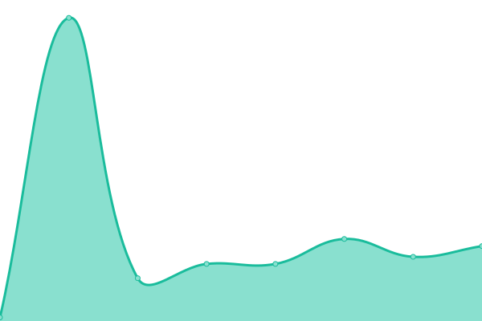

# [📈 Live Status](https://lgimenezdev.github.io/samsanet/): <!--live status--> **🟧 Partial outage**

This repository contains the open-source uptime monitor and status page for [Leandro](https://demo.upptime.js.org), powered by [Upptime](https://github.com/upptime/upptime).

With [Upptime](https://upptime.js.org), you can get your own unlimited and free uptime monitor and status page, powered entirely by a GitHub repository. We use [Issues](https://github.com/lgimenezdev/samsanet/issues) as incident reports, [Actions](https://github.com/lgimenezdev/samsanet/actions) as uptime monitors, and [Pages](https://demo.upptime.js.org) for the status page.

<!--start: status pages-->
<!-- This summary is generated by Upptime (https://github.com/upptime/upptime) -->
<!-- Do not edit this manually, your changes will be overwritten -->
<!-- prettier-ignore -->
| URL | Status | History | Response Time | Uptime |
| --- | ------ | ------- | ------------- | ------ |
|  [INTRANET](https://intranet.samsa.com.ar) | 🟥 Down | [intranet.yml](https://github.com/lgimenezdev/samsanet/commits/HEAD/history/intranet.yml) | 

 878ms
     
 | 

<a href="https://lgimenezdev.github.io/samsanet/history/intranet">99.98%</a>
    

|  [MP](https://mp.samsa.com.ar:8889) | 🟥 Down | [mp.yml](https://github.com/lgimenezdev/samsanet/commits/HEAD/history/mp.yml) | 

 813ms
     
 | 

<a href="https://lgimenezdev.github.io/samsanet/history/mp">99.99%</a>
    

|  [Acceso Clientes](https://intranet.samsa.com.ar/apex/f?p=1000) | 🟥 Down | [acceso-clientes.yml](https://github.com/lgimenezdev/samsanet/commits/HEAD/history/acceso-clientes.yml) | 

 2025ms
     
 | 

<a href="https://lgimenezdev.github.io/samsanet/history/acceso-clientes">99.99%</a>
    

|  [INTERNET FIBE](fibertel.samsa.com.ar) | 🟩 Up | [internet-fibe.yml](https://github.com/lgimenezdev/samsanet/commits/HEAD/history/internet-fibe.yml) | 

 643ms
     
 | 

<a href="https://lgimenezdev.github.io/samsanet/history/internet-fibe">0.01%</a>
    

|  [INTERNET GIGA](gigared.samsa.com.ar) | 🟥 Down | [internet-giga.yml](https://github.com/lgimenezdev/samsanet/commits/HEAD/history/internet-giga.yml) | 

 656ms
     
 | 

<a href="https://lgimenezdev.github.io/samsanet/history/internet-giga">100.00%</a>
    

|  [SITIO WEB](https://samsa.com.ar) | 🟩 Up | [sitio-web.yml](https://github.com/lgimenezdev/samsanet/commits/HEAD/history/sitio-web.yml) | 

 1525ms
     
 | 

<a href="https://lgimenezdev.github.io/samsanet/history/sitio-web">100.00%</a>
    

<!--end: status pages-->

[**Visit our status website →**](https://demo.upptime.js.org)

## 📄 License

- Powered by: [Upptime](https://github.com/upptime/upptime)
- Code: [MIT](./LICENSE) © [Leandro](https://demo.upptime.js.org)
- Data in the `./history` directory: [Open Database License](https://opendatacommons.org/licenses/odbl/1-0/)
